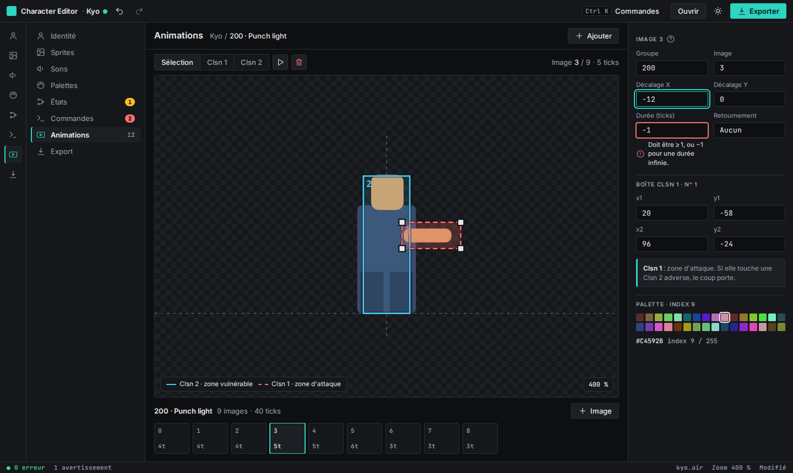
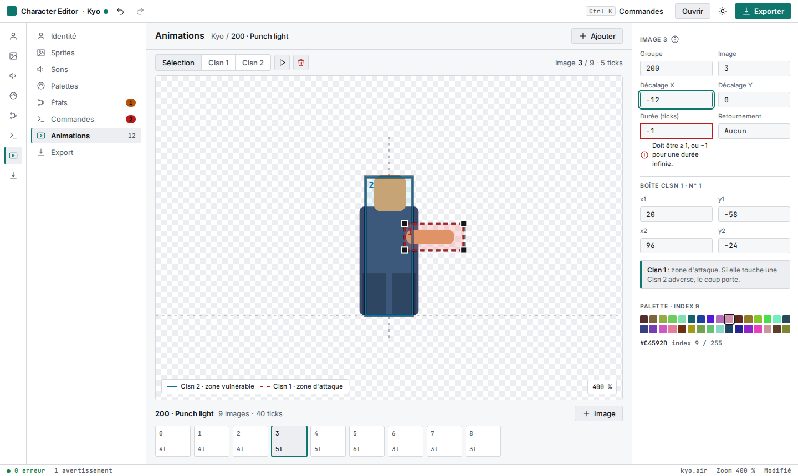
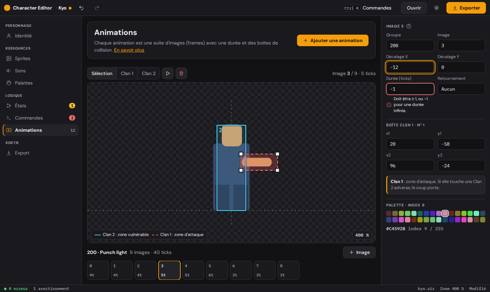
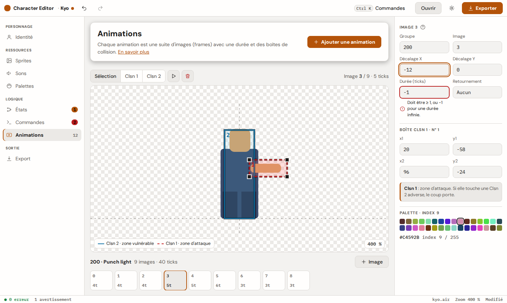
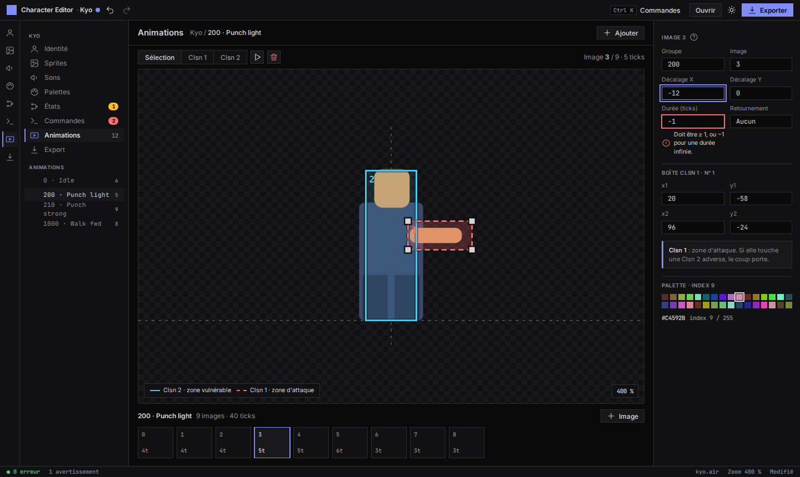
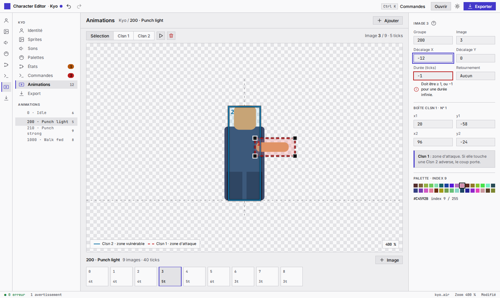

# Visual redesign of the kit: "Studio" direction, renamed tokens, dark by default

**Context:** The product owner judges the current design system ("generic zinc
and blue", poor component ergonomics) as the main cause of the editors' poor
UX. A UX audit of `character-editor` (23 findings, see that repo's
`.ux/audit/2026-10-08.md`) and a three-way style exploration were run first;
the experts consulted (visual, accessibility, platform) agreed on dense,
dark-first tooling with a single accent. Three directions were rendered on the
same key screen (the animation editor with collision boxes) and shown to the
product owner, who chose B. Full design intent: `character-editor/.ux/style.md`
and its `.ux/decisions/001-visual-direction.md`.

**Previews** (same screen, dark then light; the HTML tiles toggle the theme
with `data-theme`):

| Direction | Dark | Light | Tile |
|---|---|---|---|
| A — Instrument (teal, 3 px radii, 28 px controls) |  |  | [style-instrument.html](025-assets/style-instrument.html) |
| **B — Studio (amber, 8 px radii, 34 px controls) — chosen** |  |  | [style-studio.html](025-assets/style-studio.html) |
| C — Console (violet, square corners, 24 px controls) |  |  | [style-console.html](025-assets/style-console.html) |

**Decision:**
- **Adopt direction B "Studio"**: warm neutrals, one amber accent, DM Sans for
  the UI and IBM Plex Mono (tabular numerals) for data, 6/8/12 px radii, two
  elevation levels, comfortable density (34 px controls), 2 px focus ring.
- **Rename the color tokens** to the intent vocabulary (breaking, version 0.x):
  `accent`→`primary`, `text-on-accent`→`on-primary`, `danger`→`error`,
  `text-on-danger`→`on-error`, `text-secondary`→`text-muted`,
  `focus-ring`→`focus`. `bg`, `surface`, `border`, `text`, `success`,
  `warning` keep their names. No alias is kept.
- **New tokens:** `surface-raised`, `border-control` (control edges, ≥ 3:1, the
  existing `border` stays decorative at ~1.4:1), `annotation-clsn1/2`
  (canvas overlays), radii, two elevation levels, motion durations and
  easing, control heights, border widths, focus ring width and offset.
- **Dark is the default theme** (no `data-theme` attribute → dark); the light
  theme is a full twin selected with `data-theme="light"`. The switching
  mechanism of decision `001` is unchanged (no `prefers-color-scheme`); only the
  default flips. An invalid `data-theme` value degrades to dark.
- **Type scale** 12 / 13 / 14 (base) / 16 / 20 / 28 px, body line-height 1.45.
  Fonts are **embedded in the package** (woff2, Latin subset with French
  accents, OFL) with `@font-face` in the token CSS; system-ui stays as the
  fallback stack.
- **Two releases:** v0.15.0 = tokens and restyle of every existing component;
  v0.16.0 = new components (sidebar navigation, list row, badge, tooltip,
  toast, section header card, help hint, select, localized file drop zone).
- **Consumers are not migrated here.** They pin `^0.x`, so v0.15.0 is not
  installed automatically; each app migrates when it chooses to bump, using the
  rename table above.
- **Accessibility requirements carried into the kit:** every text pair AA in
  both themes; `border-control` and focus ≥ 3:1 against every surface they sit
  on; targets ≥ 24 px; `prefers-reduced-motion` honored; meaning never by
  color alone (annotation colors pair with line style and labels). Decision
  `009` still holds: invalid-state message text uses the text token.

**Reason:** The product owner wants a guided tool for novices that stays
usable for experts in long sessions; B gives the novice-friendly structure
(section headers, contextual help) at a density that is still acceptable,
and fixes the kit's low-contrast control borders and missing radius, elevation
and motion vocabulary at the source rather than per app.

**Rejected alternatives:**
- *A "Instrument"* — the experts' recommendation for pure expert use; calmer and
  denser, but less guiding for novices.
- *C "Console"* — IDE density (24 px controls, square corners); risks
  overwhelming novices.
- *Keep the current system and restyle per app* — duplicates work across six
  apps and leaves the root cause.
- *Token aliases for the old names* — avoids breakage but keeps two
  vocabularies; rejected because consumers migrate on their own schedule.
- *Fonts via Google Fonts or app-side only* — external dependency and
  inconsistent rendering across apps.

**Consequences:**
- The amber accent sits close to the warning color: `warning` is a distinct
  darker hue in the light theme and is always paired with an icon and a badge
  shape.
- 34 px controls are less dense than the expert recommendation; a kit-wide
  compact density mode may be added later.
- Every visual-regression baseline changes. Per decisions `015` and `021`,
  baselines are only final once regenerated on the real CI runner; local
  regeneration is provisional.
- Roughly 740 token usages across six apps (`character-editor`,
  `character-viewer-web`, `lifebar-editor`, `lifebar-viewer-web`,
  `stage-editor`, `stage-viewer-web`) need the rename when they bump.
